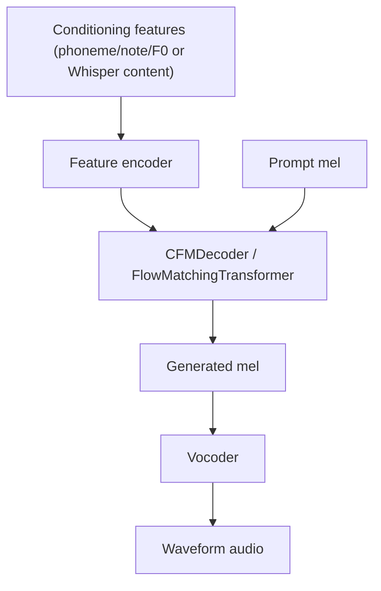
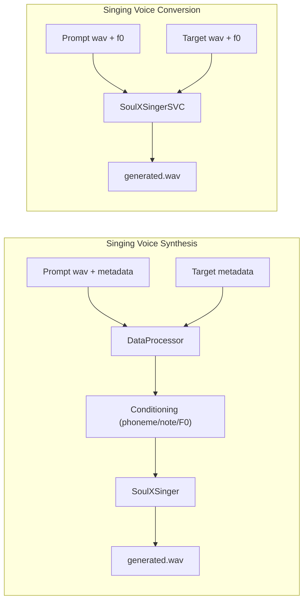

# Architecture Overview

SoulX-Singer has two model families that share a common core of sub-modules. Both are **diffusion/flow-matching** architectures that generate a mel-spectrogram conditioned on a prompt and target feature streams, then run the result through a neural vocoder to produce waveform audio.

## Shared sub-modules

The building blocks live in `soulxsinger/models/modules/` and are used by both models:

| Module | File | Role |
|--------|------|------|
| `Vocoder` | `vocoder.py` | Turns generated mel-spectrogram into waveform. Uses Vocos/PeriodGAN/SpecGAN-style backends (config in file defaults). |
| `CFMDecoder` | `decoder.py` | Thin wrapper around `FlowMatchingTransformer`. Exposes `reverse_diffusion`. |
| `FlowMatchingTransformer` | `flow_matching.py` | Core diffusion transformer (adapted from Amphion's flow-matching transformer). Runs the reverse diffusion sampling loop with classifier-free guidance (CFG). |
| `DiffLlama` | `llama.py` | The diffusion estimator backbone; a Llama-style transformer with adaptive RMSNorm conditioned on embeddings. |
| `MelSpectrogramEncoder` | `mel_transform.py` | STFT-based mel extraction with dynamic-range compression. |
| `WhisperEncoder` | `whisper_encoder.py` | Frozen `openai/whisper-base` encoder used for content features in SVC. |
| `ConvNeXtV2Block` | `convnext.py` | ConvNeXt-V2 blocks used as the pre-flow feature encoder in SVS. |

*Caption: Common two-model data path — conditioning features plus the prompt mel feed the flow-matching decoder, which produces a mel that the vocoder turns into audio.*

## SoulX-Singer (SVS)

Defined in `/soulxsinger/models/soulxsinger.py`. This is the **score/melody-conditioned synthesis** model.

Inputs (from the `meta` dict, populated by `DataProcessor`):
- **target** — phoneme sequence, `mel2note` alignment, note type, plus either note pitch (score control) or F0 (melody control)
- **prompt** — waveform, phoneme, `mel2note`, note type, plus the matching pitch/F0 stream

Components:
- `note_text_encoder`, `note_pitch_encoder`, `note_type_encoder` — per-note embeddings (phoneme, pitch, type)
- `f0_encoder` — discrete F0 bin embedding
- `preflow` — a stack of `ConvNeXtV2Block`s (feature encoder)
- `cfm_decoder` — `CFMDecoder`
- `mel`, `vocoder`

The `infer` method:
1. Concatenates prompt + target note/pitch/type/phoneme sequences.
2. Computes target F0 coarse bins (with optional pitch shift), then the target note pitch.
3. Encodes everything and runs the feature encoder.
4. Expands note-level states to mel-scale via `mel2token`, adds the F0 embedding.
5. Runs `reverse_diffusion` with the prompt mel as reference and the target region as the generation target.
6. Decodes the generated mel to audio with the vocoder, and returns the waveform.

There are two `control` modes that select which pitch conditioning to use:
- `control="score"` — uses discrete **note_pitch** (MIDI-style note values, no `gt_f0`).
- `control="melody"` — uses continuous **F0** (no note pitch).

## SoulX-Singer-SVC

Defined in `/soulxsinger/models/soulxsinger_svc.py`. This is the finetuned **singing voice conversion** model.

Inputs (direct tensors, no metadata):
- `pt_wav`/`gt_wav` — prompt and target waveforms
- `pt_f0`/`gt_f0` — prompt and target F0 contours (`.npy` arrays)

Components:
- `whisper_encoder` — frozen Whisper encoder: extracts **content** features from audio (this replaces the phoneme/note conditioning of SVS).
- `f0_encoder` — F0 bin embedding.
- `cfm_decoder`, `mel`, `vocoder`.

`infer` behavior:
- Computes optional auto pitch shift from the median F0 of prompt vs target.
- For short targets (< 30 s at sample rate) infers the whole waveform in one shot via `infer_segment`.
- For longer targets, `build_vocal_segments` splits the F0 contour into voiced segments (respecting min/max duration and silence runs), infers each overlap segment, then merges them back into a single waveform, trimming to the target length.

This is why SVC is "transcription-free": its content stream comes from Whisper embeddings rather than lyric/note transcription. See [Domain Concepts](/openwiki/domain/overview.md) for the contrast.

## Data flow overview

*Caption: SVS requires preprocessed metadata (phoneme/note/F0) while SVC is audio + F0 only.*

## Configuration

Model/audio/inference hyper-parameters live in `/soulxsinger/config/soulxsinger.yaml`:

- `audio` — hop size 480, sample rate 24 kHz, `n_fft`/`win_size` 1920, 128 mels, `fmin`/`fmax` 0/12000 Hz.
- `model.encoder` — vocab size 3000, dims 512, F0 bins 361, 4 pre-flow layers.
- `model.flow_matching` — mel dim 128, hidden 1024, 22 layers, 16 heads, CFG drop 0.2, cos time scheduler.
- `infer` — `n_steps: 32`, `cfg: 3`.

New inference flags are threaded through the CLI; see [Operations](/openwiki/operations/overview.md) and [Workflows](/openwiki/workflows/overview.md).
