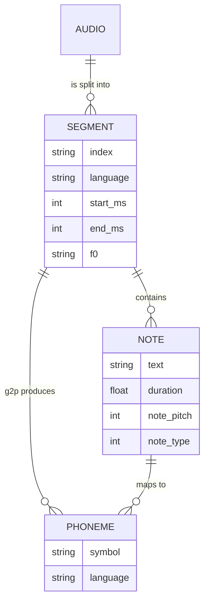

# Domain Concepts

Preprocessing and inference talk to each other through a well-defined metadata format, and the models have specific ideas about phonemes, pitches, and conditioning. This page is the canonical home for those concepts.

## Metadata format

The preprocess pipeline emits a JSON list (named like the input audio, e.g. `audio.mp3` → `audio.json`). Each element is one segment with these keys (see `preprocess/utils.py` → `convert_metadata`):

| Key | Meaning |
|-----|---------|
| `index` | Unique segment name |
| `language` | Dominant language: `Mandarin`, `Cantonese`, or `English` |
| `time` | `[start_ms, end_ms]` absolute time range |
| `duration` | Space-separated per-note durations (seconds) |
| `text` | Space-separated note texts (words, or `<SP>` for silence) |
| `phoneme` | Space-separated phoneme strings (from `g2p_transform`) |
| `note_pitch` | Space-separated per-note pitch values (MIDI-style integer, 0 = silence) |
| `note_type` | Space-separated per-note type values (see Note types below) |
| `f0` | Space-separated continuous F0 values (Hz) |

The CLI inference reads these JSON lists directly (`cli/inference.py`), then `DataProcessor` (`soulxsinger/utils/data_processor.py`) converts a segment into model-ready tensors: `phoneme`, `note_pitch`, `note_type`, `mel2note`, `f0`, and (for the prompt) `waveform`.

### Processing within DataProcessor

- `merge_phoneme` — merges consecutive identical `<SP>` frames and normalizes `<AP>` → `<SP>`.
- `preprocess` — inserts `<BOW>`/`<EOW>` (begin/end of word) markers per note, expands English hyphenated phonemes, and computes `mel2note` (mel-frame → note-token alignment). This encodes word boundaries into the note stream.
- `process` — merges phonemes, runs `preprocess`, clips `f0`/`mel2note` to the shortest length, and (if a wav path is given) loads the prompt waveform.

The phoneme → index mapping comes from `soulxsinger/utils/phoneme/phone_set.json` (loaded once at `DataProcessor` init).

## Phoneme representation

Phoneme strings are produced by `preprocess/tools/g2p.py` (`g2p_transform`) and are language-prefixed:

- Mandarin: `zh_...` (g2pM)
- Cantonese: `yue_...` (ToJyutping, with tone)
- English: `en_...` with hyphen-separated sub-phonemes (g2p_en)

Special tokens: `<SP>` (silence/rest), `<AP>` (aspiration, normalized to `<SP>` at the model), `<BOW>`/`<EOW>` (word boundary markers inserted by `DataProcessor`), `<PAD>`, `<SEP>` (between English words within one note).

## F0 / pitch modeling

- **Continuous F0** comes from the preprocess `F0Extractor` (RMVPE) and is stored per segment.
- The models quantize F0 into discrete bins with `f0_to_coarse` (`f0_bin=361`, covering C1–B6 with bin 0 for silence): `f0_cents = 1200 * log2(f0 / C1)` mapped to bins.
- `soulxsinger/utils/pitch_utils.py` has additional mel-based (`f0_to_coarse_mel`) and MIDI/C1-based (`f0_to_coarse_midi`) helpers, plus `to_lf0`/`to_f0` conversions.

**Pitch shift** is keyed on F0 or note pitch and applied in semitones:
- In SVS (`soulxsinger.py`), `auto_shift` computes a shift from the median note-pitch/F0 of prompt vs target, and the target F0 bins / note pitches are shifted accordingly (F0 shift is scaled `x5` when applied to coarse bins).
- In SVC (`soulxsinger_svc.py`), the same median-F0 logic computes `pitch_shift`, applied in `infer_segment` (again `pitch_shift * 5` on coarse bins).

This is how regeneration matches the target melody while adopting the prompt's timbre.

## Note types

`note_type` is an integer per note. In `DataProcessor.merge_phoneme`, silence frames (`<SP>`) get type `1`. During `preprocess`, note types are expanded alongside phonemes. The exact semantic values are defined during transcription by ROSVOT/`NoteTranscriber`; the model uses these as conditioning categories for the note stream.

## Control modes

The SVS model selects its pitch conditioning via `control` (`melody` or `score`):

- **Score mode** — conditions on `note_pitch` (discrete MIDI note values); no `gt_f0` is used.
- **Melody mode** — conditions on continuous `gt_f0`; no `note_pitch` is used.

The CLI validates only these two values (`cli/inference.py`). Both use the phoneme/note-type stream; they differ only in which pitch signal drives the target.

## SVS vs SVC conditioning contrast

| | SVS (`SoulXSinger`) | SVC (`SoulXSingerSVC`) |
|---|---|---|
| Content features | phoneme + note pitch/type (from metadata) | Whisper encoder embeddings (from audio) |
| Pitch | F0 (melody) or note pitch (score) | F0 |
| Needs transcription | Yes | No (transcription-free) |
| Inputs | metadata + prompt wav | waveforms + F0 arrays |

This contrast is central: the shared core is the flow-matching decoder + vocoder, but the **conditioning front-end differs**, which is why one needs lyrics/notes and the other does not. See [Architecture Overview](/openwiki/architecture/overview.md) for the models.

## Data model summary

*Caption: Simplified data model — audio to segments to notes/ phonemes, mirroring `convert_metadata` and `midi_parser.py`'s `Note`.*
