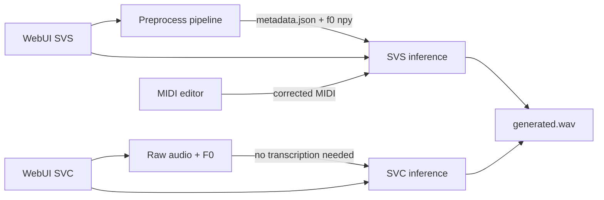

# SoulX-Singer Wiki Quickstart

Welcome to the OpenWiki knowledge base for **SoulX-Singer**, the official
inference code for *"SoulX-Singer: Towards High-Quality Zero-Shot Singing Voice
Synthesis"* (arXiv 2602.07803, Apache 2.0).

## What this repository is

- **SoulX-Singer (SVS)** — zero-shot singing voice synthesis: generate singing
  for an unseen singer conditioned on a reference prompt plus either an **F0
  melody contour** (`melody` control) or a **MIDI score** (`score` control).
- **SoulX-Singer-SVC (SVC)** — singing voice conversion finetuned from
  SoulX-Singer: convert raw target singing audio into the prompt singer's
  timbre, **without** lyrics transcription or MIDI inputs.
- A full **preprocessing toolkit** (vocal separation, dereverb, F0 extraction,
  ASR lyrics transcription, note transcription, MIDI editing) that produces the
  metadata the SVS model consumes.
- **Two Gradio WebUIs** wrapping both inference paths.

This is an **inference-only** codebase: there is no training code, and model
weights are downloaded from Hugging Face Hub (they are gitignored).

## Quick start (run something now)

```bash
conda create -n soulxsinger -y python=3.10 && conda activate soulxsinger
pip install -r requirements.txt
pip install -r preprocess/requirements.txt   # full pipeline deps

hf download Soul-AILab/SoulX-Singer --local-dir pretrained_models/SoulX-Singer
hf download Soul-AILab/SoulX-Singer-Preprocess --local-dir pretrained_models/SoulX-Singer-Preprocess

bash example/infer.sh        # SVS demo (needs metadata)
bash example/infer_svc.sh    # SVC demo (wav + F0 only)
python webui.py              # SVS WebUI
python webui_svc.py          # SVC WebUI
```

See [Operations and Runbook](/openwiki/operations/overview.md) for setup
details, model layout, and troubleshooting.

## How this wiki is organized

- [Architecture Overview](/openwiki/architecture/overview.md) — the SVS/SVC
  model families, shared neural modules (flow matching, vocoder, Whisper
  encoder, mel front-end), config, and FP16 handling.
- [Workflows](/openwiki/workflows/overview.md) — the preprocessing pipeline,
  SVS inference, SVC inference, and WebUI flows with diagrams.
- [Domain Concepts](/openwiki/domain/overview.md) — metadata JSON schema,
  phoneme/g2p representation, F0 and pitch binning, control modes, silence
  handling, and MIDI interop.
- [Operations and Runbook](/openwiki/operations/overview.md) — environment
  setup, model downloads, GPU memory notes, and known fixes from git history.
- [Testing and Validation](/openwiki/testing/overview.md) — the (informal) test
  surface: example smoke tests and regression-prone areas.
- [Source Map](/openwiki/source-map.md) — full repository inventory and where to
  start reading each area.

## Key relationships at a glance



## Quick reading order for new engineers

1. [`README.md`](/README.md) — product context and public quick start.
2. [`preprocess/README.md`](/preprocess/README.md) — what the toolkit produces.
3. [Architecture](/openwiki/architecture/overview.md) — how the models work.
4. [Workflows](/openwiki/workflows/overview.md) — how the pieces connect.
5. [Domain Concepts](/openwiki/domain/overview.md) — the metadata contract.
6. [Operations](/openwiki/operations/overview.md) — before you run anything on
   a new machine.

## What this wiki tracks (change-oriented summary)

- **Where changes land**: preprocessing (`preprocess/`), model code
  (`soulxsinger/`), inference CLIs (`cli/`), WebUIs (`webui*.py`), MIDI editor
  (`preprocess/tools/midi_editor/`).
- **Watch-outs on change**: segment time math (32-bit overflow on Windows),
  segment merging shape mismatches, FP16 mel-in-FP32 requirement, GPU memory
  leaks in WebUIs, and the split torch/numpy pins between the two requirements
  files.
- **Latest evolution**: the `feat/svc` merge (`dfb9568`) introduced the entire
  SVC stack (Whisper encoder, SVC model, SVC CLI, SVC WebUI); FP16 support
  (`6bc423f`) and several bug fixes (`33ad03f`, `f177900`, `5c45496`,
  `676a4b3`, `acd498a`) followed. Recent commits (`81aeb3a` et al.) only touch
  the WeChat QR asset.

## Backlog

- **Formal test suite** — no `tests/` exists; the example scripts are the only
  automated-ish validation (`/openwiki/testing/overview.md`). Deferred: the
  project has not added one yet.
- **MIDI-based interactive input** — roadmap item "🎹 Inference support for
  user-friendly MIDI-based input" is unchecked in `README.md`; the MIDI editor
  exists but CLI-side MIDI input isn't wired. Deferred: incomplete upstream
  feature.
- **Comprehensive tutorials** — roadmap item "📚 Comprehensive tutorials and
  usage documentation" is unchecked. Deferred: upstream work item.
- **SVC data prep docs** — `preprocess.sh` documents `midi_transcribe=False`
  for SVC, but there is no dedicated SVC data-prep tutorial page. Deferred: thin
  existing content; covered by the runbook.
