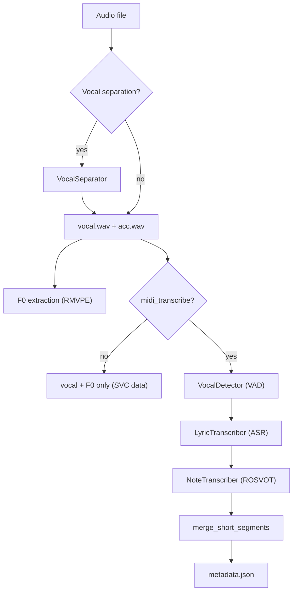
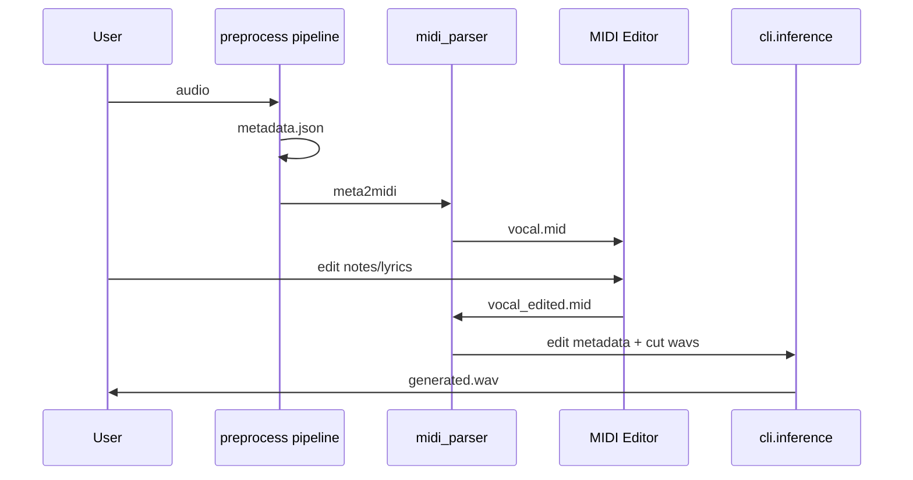

# Key Workflows

This page documents the three headline end-to-end workflows and how the web UIs orchestrate them. The entrypoints are the shell scripts in `/example/` and the Python modules in `/cli/` and `/preprocess/`.

## Preprocessing pipeline

Entrypoint: `python -m preprocess.pipeline` (wrapped by `example/preprocess.sh`).

`PreprocessPipeline` (`preprocess/pipeline.py`) turns a single audio file into SoulX-Singer-style metadata. Steps:

1. **Vocal separation & dereverberation** (`VocalSeparator`) — optional; extracts the lead vocal and writes `vocal.wav` / `acc.wav`. If disabled, the original audio is used as the vocal.
2. **F0 extraction** (`F0Extractor`, RMVPE-based) — computes the F0 contour (`*_f0.npy`).
3. **Vocal detection** (`VocalDetector`) — VAD-based segmentation of the vocal into segments.
4. **Lyric transcription** (`LyricTranscriber`) — ASR (Paraformer for Mandarin/Cantonese, Parakeet for English) producing words and durations.
5. **Note transcription** (`NoteTranscriber`, ROSVOT-based) — converts each segment to note-level pitch/type.
6. **Segmentation merging** (`merge_short_segments` / `convert_metadata` in `preprocess/utils.py`) — merges short segments into chunks (up to `max_merge_duration`) and writes the final `metadata.json` next to the input audio, plus intermediate artifacts under `save_dir`.

`midi_transcribe=False` skips the lyric/note/VAD stages, producing only vocal + F0 — this is the mode used to prepare SVC data (see `example/preprocess.sh`).

*Caption: Preprocessing flow — from raw audio to metadata.json (or vocal+F0 only for SVC).*

## Singing Voice Synthesis (SVS)

Entrypoint: `python -m cli.inference` (wrapped by `example/infer.sh`).

Consumes:
- a prompt waveform + prompt `metadata.json` (the reference timbre)
- a target `metadata.json` (the melody/lyrics to synthesize)
- the phoneme set at `soulxsinger/utils/phoneme/phone_set.json`

`cli/inference.py`:
1. `build_model` loads the checkpoint (`model.pt`) with optional FP16 (`mel` kept in FP32).
2. `process` builds a `DataProcessor`, loads prompt/target metadata JSON lists.
3. For each target segment it tokenizes prompt + target via `DataProcessor.process`, calls `model.infer(...)`, and merges the generated audio into a placeholder buffer sized from the last target segment's end time.
4. Writes `generated.wav` to `--save_dir`.

Synthesis quality depends heavily on the accuracy of the generated metadata; auto-transcribed lyrics/notes are often misaligned. Editing the MIDI and re-importing (below) fixes alignment.

## Singing Voice Conversion (SVC)

Entrypoint: `python -m cli.inference_svc` (wrapped by `example/infer_svc.sh`).

Consumes prompt/target waveforms and prompt/target F0 arrays (no metadata). `cli/inference_svc.py` loads them, calls `SoulXSingerSVC.infer`, and writes `generated.wav`. For long targets the model segments by F0 and merges (handled inside `soulxsinger_svc.py`).

## Web UIs

`webui.py` (SVS) and `webui_svc.py` (SVC) are Gradio apps that wrap the same code paths:

- **webui.py (SVS)** — lets you upload prompt/target audio, run the in-UI transcription (this calls `PreprocessPipeline`), view/edit metadata and MIDI, then click generate (this calls `cli.inference.build_model` + `process`). It is i18n'd (en/zh) and ships Gradio `Examples`.
- **webui_svc.py (SVC)** — upload prompt/target audio (with optional vocal separation and auto pitch shift / auto accompaniment mixing), then convert via `cli.inference_svc`.

They are the same inference functions as the CLI, just orchestrated in a browser UI.

## MIDI edit round-trip

The MIDI Editor (a separate Vite/TypeScript app under `preprocess/tools/midi_editor/`) is used to correct mistranscribed lyrics/pitches. `preprocess/tools/midi_parser.py` bridges the two representations:

- `meta2midi` — export `metadata.json` → `.mid` for editing.
- `midi2meta` — import an edited `.mid` back into SoulX-Singer metadata (and cut wavs).

The `Note` dataclass in `midi_parser.py` is the intermediate representation between metadata notes and MIDI events. After editing, use the regenerated metadata as the target in SVS. See the [Domain Concepts](/openwiki/domain/overview.md) page for the metadata/MIDI data model.

*Caption: MIDI edit round-trip — automatic metadata is exported to MIDI, corrected in the editor, and converted back into metadata for synthesis.*
